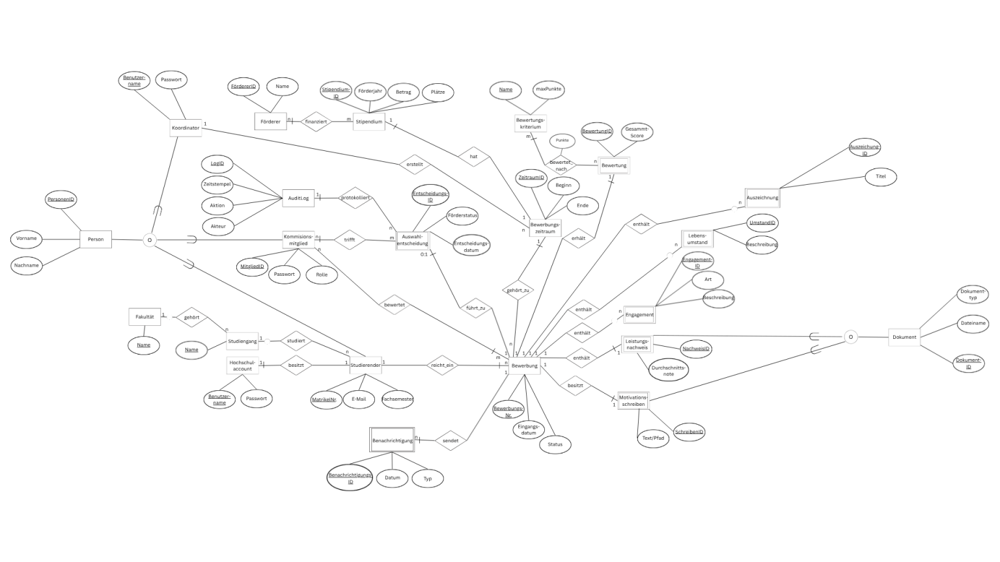

# Deutschlandstipendium – Datenbank und Dashboard

Dieses Studienprojekt bildet die Bewerbung um ein Stipendium, die Bewertung
einzelner Bewerbungsbestandteile und die anschließende Förderentscheidung
in einer PostgreSQL-Datenbank und einer Streamlit-Anwendung ab.

Das System ist eine **lokale Projektdemo**, kein produktives Hochschulportal.
Für Tests sollten ausschließlich fiktive personenbezogene Daten und
Test-PDFs verwendet werden.

## Inhalt

1. Projektziel und Anforderungen
2. Benutzerrollen und Use Cases
3. Entwurf und fachliche Entscheidungen
4. Relationales Modell und Normalisierung
5. Datendefinition, View und Indizes
6. Die zehn SQL-Abfragen
7. Anwendung und Benutzerführung
8. Einrichtung und Start
9. Tests und Erfahrungen aus der Entwicklung
10. Grenzen und Fazit

## 1. Projektziel und Anforderungen

Ziel ist ein nachvollziehbarer Ablauf für die Vergabe von Stipendien:

```text
Registrierung und Bewerbung
        ↓
Einreichen von Angaben und Unterlagen
        ↓
Bewertung einzelner Gegenstände
        ↓
Förderentscheidung
```

Das Projekt bearbeitet die folgenden Bestandteile der Aufgabenstellung:

| Bestandteil | Umsetzung im Projekt |
|---|---|
| Anforderungsanalyse | Drei Use Cases mit Haupt- und Alternativabläufen |
| Konzeptueller Entwurf | ER-Diagramm für das Stipendienverfahren |
| Logischer Entwurf | Überführung in Relationen und Prüfung funktionaler Abhängigkeiten |
| Datendefinition | PostgreSQL-Tabellen mit Primär- und Fremdschlüsseln sowie weiteren Constraints |
| View | Berechnete Rangliste |
| Physischer Entwurf | Zusätzliche Indizes für Abfragen auf Bewertungen und Dokumente |
| SQL-Anfragen | Zehn dokumentierte Abfragen mit Join, Aggregation, Unterabfrage und Parametrisierung |
| Tool | Rollenabhängige Streamlit-Anwendung mit PostgreSQL-Verbindung |

[`pictures/ER_diagramm.png`](pictures/ER_diagramm.png).


## 2. Benutzerrollen und Use Cases

### Bewerberin oder Bewerber

Bewerber können sich registrieren, anmelden, innerhalb eines offenen
Bewerbungszeitraums einen Entwurf anlegen, Angaben ergänzen und PDFs mit
einer Dokumentart hochladen. Vor der verbindlichen Einreichung prüft die
Anwendung insbesondere Motivationsschreiben und Leistungsnachweis.

Nach dem Einreichen sehen Bewerber ihren eigenen Status, vorgemerkte
Benachrichtigungen und gegebenenfalls ihre Förderentscheidung. Sie sehen
keine Bewerbungen anderer Personen und keine interne Rangliste.

### Kommissionsmitglied

Kommissionsmitglieder suchen und prüfen eingereichte Bewerbungen.
Bewertungsgegenstände sind Dokumente, Engagement-Angaben, Lebensumstände
und Auszeichnungen. Eine Bewertung gehört zu einem konkreten Gegenstand
und einem Mitglied. Verschiedene Mitglieder können unterschiedliche
Gegenstände derselben Bewerbung bearbeiten.

Die Kommission vergibt Punkte anhand der Kriterien eines
Bewerbungszeitraums. Nach der Prüfung trifft sie eine gesonderte
Förderentscheidung: `Bewilligt`, `Warteliste` oder `Abgelehnt`.

### Koordination

Die Koordination ist als Verwaltungsrolle für Stipendien,
Bewerbungszeiträume, Kapazitäten und Benutzerkonten vorgesehen. Sie ist
von der öffentlichen Bewerberregistrierung getrennt:
Kommissions- und Koordinationskonten werden nicht von Bewerbern selbst
angelegt.

Der tatsächlich verfügbare Umfang dieser Verwaltungsoberfläche hängt
vom aktuellen Stand von `app/main.py` ab. Die Datenbank besitzt bereits
die für Stipendien, Zeiträume, Konten und Rollen benötigten Grunddaten.

### UC1 – Bewerbung einreichen

**Vorbedingungen:** Bewerberkonto vorhanden; Bewerbungszeitraum offen;
für die Person und den Zeitraum besteht noch keine weitere Bewerbung.

**Hauptablauf:**

1. Bewerber meldet sich an und legt einen Entwurf an.
2. Er ergänzt optional Engagement, Lebensumstände und Auszeichnungen.
3. Er lädt Motivationsschreiben und Leistungsnachweis als PDFs hoch.
4. Das System zeigt fehlende Pflichtunterlagen an.
5. Der Bewerber bestätigt die Einreichung.
6. Das System setzt die Bewerbung auf `Eingereicht`, speichert das
   Eingangsdatum und legt einen Benachrichtigungseintrag an.

**Alternativen:** Frist abgelaufen; Bewerbung für denselben Zeitraum
bereits vorhanden; Pflicht-PDF fehlt; Datei ist ungültig oder zu groß;
Änderungsversuch an einer fremden oder bereits eingereichten Bewerbung.

### UC2 – Bewerbungsgegenstände bewerten

**Vorbedingungen:** Kommissionsmitglied angemeldet; Bewerbung
eingereicht und noch nicht endgültig entschieden.

**Hauptablauf:**

1. Mitglied wählt einen Bewerbungszeitraum und sucht eine Bewerbung.
2. Es öffnet einen konkreten Gegenstand und betrachtet PDF oder Text.
3. Es vergibt Punkte für ein Kriterium und ergänzt einen Kommentar.
4. Das System prüft Zuordnung und Punktegrenzen und speichert die
   Bewertung.
5. Der Bearbeitungsstand wird aus den vorhandenen Gegenständen und
   abgeschlossenen Bewertungen berechnet.

**Alternativen:** Punktzahl überschreitet das Maximum; Kriterium gehört
nicht zum Zeitraum; Gegenstand gehört nicht zur Bewerbung; ein anderes
Mitglied hat den Gegenstand bereits übernommen; lokale PDF ist nicht
verfügbar; es wurde bereits eine Förderentscheidung getroffen.

### UC3 – Förderentscheidung treffen

**Vorbedingungen:** Bewerbungsfrist abgelaufen; Bewerbung geprüft;
Pflichtdokumente vorhanden; noch keine Entscheidung für diese Bewerbung.

**Hauptablauf:**

1. Kommissionsmitglied betrachtet Bewerbung, Bewertungen und
   verfügbare Förderplätze des zugehörigen Zeitraums.
2. Es wählt `Bewilligt`, `Warteliste` oder `Abgelehnt` und erfasst
   eine Begründung.
3. Das System prüft erneut Frist, Entscheidungsreife und bei einer
   Bewilligung die Platzgrenze.
4. Entscheidung und beteiligtes Mitglied werden gespeichert; die
   Bewerbung wird abgeschlossen.

**Alternativen:** Frist läuft noch; Unterlagen oder Bewertungen fehlen;
eine Entscheidung existiert bereits; die Begründung fehlt; bei
`Bewilligt` sind alle Förderplätze belegt.

Ein Fristende am **30.09.** bedeutet: Bewerbungen sind am 30.09. noch
möglich, Entscheidungen erst **ab dem 01.10.**

Die Förderplatzgrenze wird **pro Bewerbungszeitraum** gespeichert.
25 Plätze sind ein Demo-Standardwert und keine allgemeine Eigenschaft
jedes Stipendiums. Eine ausgeschöpfte Kapazität schließt die
Bewerbungsfrist nicht nachträglich oder vorzeitig.

## 3. Konzeptueller Entwurf und fachliche Entscheidungen

Das ER-Diagramm modelliert unter anderem Personen und Rollen,
Stipendien und Förderer, Bewerbungszeiträume, Bewerbungen, Dokumente,
Engagement, Lebensumstände, Auszeichnungen, Bewertungskriterien,
Bewertungen, Entscheidungen und Benachrichtigungen.



Während der Entwicklung wurden mehrere Annahmen präzisiert:

| Ursprüngliche Überlegung | Entscheidung |
|---|---|
| Eine Bewertung bezieht sich auf die gesamte Bewerbung. | Eine Bewertung betrifft genau ein Dokument, ein Engagement, einen Lebensumstand oder eine Auszeichnung. |
| Ein Mitglied muss die komplette Bewerbung bewerten. | Unterschiedliche Gegenstände können von unterschiedlichen Mitgliedern bewertet werden. |
| Die Rangliste wird als dauerhaft gepflegte Tabelle geführt. | Score und Rang werden aus gespeicherten Einzelpunkten berechnet. |
| „Alles bewertet“ bedeutet „Stipendium vergeben“. | Bewertungsstand und Förderentscheidung sind getrennte Sachverhalte. |
| Für jedes Stipendium gelten immer 25 Plätze. | Die maximale Zahl wird für jeden Bewerbungszeitraum festgelegt. |
| Vergabe kann schon während der Bewerbungsphase erfolgen. | Neue Entscheidungen sind erst nach Ablauf der Bewerbungsfrist zulässig. |

Die Änderung des Bewertungsgegenstands entstand während der Arbeit an der
Kommissionsoberfläche: Das erste Schema konnte ausdrücken, **wer** eine
Bewerbung bewertet, aber nicht eindeutig, **welche konkrete Unterlage oder
Angabe** bewertet wurde. Die bestehende Datenbank wurde entsprechend
erweitert; vorhandene Demobewertungen wurden konkreten
Engagement-Angaben zugeordnet.

Die Anzahl der **ER-Entitätstypen** ist nicht mit der Anzahl der
SQL-Tabellen gleichzusetzen. Bei der Überführung entstehen zusätzliche
Relationen für m:n-Beziehungen. Später ergänzte Funktionen wie Login
erweitern außerdem das physische Schema.

## 4. Logischer Entwurf und Normalisierung

Die ursprüngliche Überführung des Modells ergab 26 Relationen. Danach
wurden unter anderem das Bewertungsschema geändert und `login_konto`
ergänzt. Die Zahl 26 bezeichnet deshalb den ursprünglichen
Überführungsstand, **nicht ungeprüft die aktuelle Tabellenanzahl**.

Beispiele zentraler Beziehungen im relationalen Schema:

- `bewerbung` verweist auf Studierenden und Bewerbungszeitraum.
- `UNIQUE(studierenden_id, zeitraum_id)` verhindert eine zweite
  Bewerbung derselben Person für denselben Zeitraum.
- `dokument`, `engagement`, `lebensumstand` und `auszeichnung`
  gehören zu einer Bewerbung.
- `bewertung` verweist auf ein Kommissionsmitglied und genau einen
  konkreten Bewertungsgegenstand.
- `bewertungspunkt` speichert Punkte je Bewertung und Kriterium.
- `zeitraum_kriterium` speichert die im jeweiligen Zeitraum geltenden
  Kriterien und Gewichtungen.
- `auswahlentscheidung` erlaubt höchstens eine aktuelle Entscheidung
  je Bewerbung.
- `login_konto` verbindet eine Person mit einer eindeutigen
  Login-E-Mail und einem Passwort-Hash.

Beispiele funktionaler Abhängigkeiten:

```text
bewerbungs_nr → studierenden_id, zeitraum_id, status, ...
(studierenden_id, zeitraum_id) → bewerbungs_nr
(bewertung_id, kriterium_id) → punkte
(zeitraum_id, kriterium_id) → gewichtung
```

Die Zerlegung vermeidet etwa, Studiengangsnamen, Personennamen und
Bewerbungsfristen in jeder Bewerbungszeile erneut zu speichern.
Für die ursprünglich abgeleiteten Relationen wurden die funktionalen
Abhängigkeiten und Normalformen systematisch betrachtet. Änderungen
am Schema müssen in einer endgültigen schriftlichen Normalformprüfung
ebenfalls berücksichtigt werden.

Normalisierung allein sichert nicht jede Geschäftsregel: Ob Punkte
unterhalb des Maximums liegen oder ein Kriterium zum Zeitraum gehört,
betrifft mehrere Tabellen und wird zusätzlich geprüft.

## 5. Datendefinition, View und Indizes

## Entitäten und Datenbanktabellen

Ein **Entitätstyp** beschreibt einen Gegenstand der Fachwelt, beispielsweise
eine Bewerbung. Bei der Umsetzung entsteht daraus in der Regel eine Tabelle.
Zusätzliche Tabellen bilden Beziehungen ab, insbesondere m:n-Beziehungen.
Daher ist die Anzahl der Tabellen nicht identisch mit der Anzahl der
Entitätstypen im ER-Diagramm.

**PK** = Primärschlüssel, **FK** = Fremdschlüssel,
**UNIQUE** = Wert oder Kombination darf nur einmal vorkommen.

### Personen und Hochschule

| Entität / Tabelle | Wichtige Spalten | Bedeutung und Beziehungen |
|---|---|---|
| `person` | `personen_id` (PK), `vorname`, `nachname` | Gemeinsame Personendaten. |
| `studierender` | `personen_id` (PK, FK → `person`), `matrikel_nr` (UNIQUE), `email`, `fachsemester`, `studiengang_id` (FK) | Bewerberprofil einer Person. |
| `kommissionsmitglied` | `personen_id` (PK, FK → `person`), `rolle` | Bewertet Bewerbungsgegenstände. `Koordination` ist im Projekt eine besondere Rolle innerhalb dieser Tabelle. |
| `fakultaet` | `fakultaet_id` (PK), `name` | Fakultät der Hochschule. |
| `studiengang` | `studiengang_id` (PK), `name`, `fakultaet_id` (FK) | Studiengang innerhalb einer Fakultät. |
| `hochschulaccount` | `account_id` (PK), `benutzername`, `studierenden_id` (FK, UNIQUE) | Ursprünglich modellierter Account eines Studierenden. |
| `login_konto` | `konto_id` (PK), `personen_id` (FK, UNIQUE), `email` (eindeutig), `passwort_hash`, `aktiv` | Tatsächliches Login für Bewerber und Kommissionsmitglieder. Es wird kein Klartextpasswort gespeichert. |

`hochschulaccount` und `login_konto` haben derzeit unterschiedliche Aufgaben:
Ersteres stammt aus dem ursprünglichen Fachmodell; Letzteres übernimmt die
Anmeldung in der Anwendung. Ob beide im endgültigen Modell benötigt werden,
ist eine bewusste Entwurfsfrage.

### Stipendium und Bewerbung

| Entität / Tabelle | Wichtige Spalten | Bedeutung und Beziehungen |
|---|---|---|
| `foerderer` | `foerderer_id` (PK), `name` | Person oder Organisation, die ein Stipendium finanziert. |
| `stipendium` | `stipendium_id` (PK), `bezeichnung`, `foerderbetrag` | Förderangebot. Der Förderbetrag ist nicht die Zahl verfügbarer Plätze. |
| `bewerbungszeitraum` | `zeitraum_id` (PK), `stipendium_id` (FK), `beginn`, `ende`, `max_foerderplaetze` | Konkrete Ausschreibung eines Stipendiums mit Frist und maximaler Zahl an Bewilligungen. |
| `bewerbung` | `bewerbungs_nr` (PK), `studierenden_id` (FK), `zeitraum_id` (FK), `erstellungsdatum`, `eingangsdatum`, `status` | Bewerbung einer Person für genau einen Zeitraum. Die Kombination aus Studierendem und Zeitraum ist eindeutig. |

**Beispiel:** Ein Stipendium kann mehrere Bewerbungszeiträume haben. Ein
Studierender kann sich in unterschiedlichen Zeiträumen erneut bewerben,
aber höchstens einmal innerhalb desselben Zeitraums.

### Unterlagen und Angaben

| Entität / Tabelle | Wichtige Spalten | Bedeutung und Beziehungen |
|---|---|---|
| `dokument` | `dokument_id` (PK), `bewerbungs_nr` (FK), `dateiname`, `dokumenttyp`, `dateipfad` | Datei einer Bewerbung. Der Dateipfad verweist in der lokalen Demo auf die gespeicherte PDF. |
| `motivationsschreiben` | `dokument_id` (PK, FK → `dokument`) | Kennzeichnet ein Dokument als Motivationsschreiben. |
| `leistungsnachweis` | `dokument_id` (PK, FK → `dokument`), `durchschnittsnote` | Kennzeichnet ein Dokument als Leistungsnachweis. |
| `engagement` | `engagement_id` (PK), `bewerbungs_nr` (FK), `art`, `beschreibung` | Eigenständige Engagement-Angabe; auch ohne PDF möglich. |
| `lebensumstand` | `umstand_id` (PK), `bewerbungs_nr` (FK), `beschreibung` | Eigenständige Angabe zu einem relevanten Lebensumstand. |
| `auszeichnung` | `auszeichnung_id` (PK), `bewerbungs_nr` (FK), `titel`, `beschreibung` | Eigenständige Auszeichnungsangabe. |

Eine Angabe und ein Dokument sind **nicht dasselbe**: Das Engagement enthält
beispielsweise die Beschreibung einer Tätigkeit. Eine PDF kann zusätzlich
als Nachweis für diese Tätigkeit dienen.

### Bewertung und Entscheidung

| Entität / Tabelle | Wichtige Spalten | Bedeutung und Beziehungen |
|---|---|---|
| `bewertungskriterium` | `kriterium_id` (PK), `name`, `max_punkte` | Definiert ein Bewertungskriterium und seine maximale Punktzahl. |
| `bewertung` | `bewertung_id` (PK), `bewerbungs_nr` (FK), `mitglied_id` (FK), `dokument_id` / `engagement_id` / `umstand_id` / `auszeichnung_id` (optionale FKs), `bewertungsdatum`, `status`, `kommentar` | Bewertung durch ein Mitglied. **Genau eine** der vier Gegenstands-IDs muss gesetzt sein. |
| `auswahlentscheidung` | `entscheidungs_id` (PK), `bewerbungs_nr` (FK, UNIQUE), `foerderstatus`, `entscheidungsdatum`, `begruendung` | Aktuelle Förderentscheidung zu einer Bewerbung. |
| `benachrichtigung` | `benachrichtigungs_id` (PK), `bewerbungs_nr` (FK), `datum`, `typ`, `sendestatus` | Vorgemerkte Nachricht, etwa Eingangsbestätigung oder Förderentscheidung. |
| `audit_log` | `log_id` (PK), `mitglied_id` (FK), `bewertung_id` oder `entscheidungs_id` (FK), `zeitstempel`, `aktion`, `alter_wert`, `neuer_wert` | Protokolliert ausgewählte Änderungen an Bewertungen und Entscheidungen. |

Die Punkte stehen **nicht als einzelne Zahl in `bewertung`**: Eine Bewertung
kann Punkte für Kriterien enthalten. Diese Zuordnung übernimmt
`bewertungspunkt`.

### Zusätzliche Tabellen für Beziehungen

Diese Tabellen sind bei der Überführung ins relationale Modell entstanden.
Sie müssen nicht alle als eigenständige Entitätstypen im ER-Diagramm zählen.

| Beziehungstabelle | Wichtige Spalten | Zweck |
|---|---|---|
| `finanzierung` | `foerderer_id` + `stipendium_id` (gemeinsamer PK), `finanzierungsbetrag` | Verbindet Förderer und Stipendien. |
| `zeitraum_kriterium` | `zeitraum_id` + `kriterium_id` (gemeinsamer PK), `gewichtung` | Legt fest, welche Kriterien in einem Zeitraum gelten und wie sie gewichtet werden. |
| `bewertungspunkt` | `bewertung_id` + `kriterium_id` (gemeinsamer PK), `punkte` | Speichert die Punkte für ein Kriterium innerhalb einer konkreten Bewertung. |
| `entscheidungsbeteiligung` | `entscheidungs_id` + `mitglied_id` (gemeinsamer PK) | Hält beteiligte Kommissionsmitglieder einer Entscheidung fest. |
| `dokumentbeleg` | `dokument_id` (PK), `engagement_id` oder `umstand_id` oder `auszeichnung_id` (FK) | Ordnet eine PDF optional genau einer Bewerbungsangabe als Nachweis zu. |

### Wie hängen die Tabellen zusammen?

Vereinfacht lässt sich ein vollständiger Vorgang so verfolgen:

```text
person
  └── studierender
        └── bewerbung
              ├── bewerbungszeitraum ── stipendium
              ├── dokument
              ├── engagement / lebensumstand / auszeichnung
              ├── bewertung ── kommissionsmitglied
              │     └── bewertungspunkt ── bewertungskriterium
              ├── auswahlentscheidung
              └── benachrichtigung

Die SQL-Dateien im Ordner `sql/` enthalten die Tabellendefinitionen und
spätere Schemaänderungen. Primärschlüssel identifizieren Datensätze;
Fremdschlüssel sichern die Beziehungen zwischen ihnen. `UNIQUE`,
`NOT NULL`, `CHECK` und Trigger ergänzen fachliche Regeln.

### View `rangliste`

Die View berechnet für abgeschlossene Bewerbungen den Score aus
Einzelpunkten und den Gewichtungen des Bewerbungszeitraums. Innerhalb
eines Zeitraums wird daraus eine Position ermittelt. Gleichstände
können denselben Rang erhalten.

Wichtig: Eine Ranglistenposition wird nicht unabhängig vom Score
gespeichert. Bewerbungen, die noch nicht `Abgeschlossen` sind,
erscheinen nach der derzeitigen View-Definition nicht in der Rangliste.

### Zusätzliche Indizes

- Ein Index auf `bewertung(bewerbungs_nr)` unterstützt das Finden der
  Einzelbewertungen einer Bewerbung und darauf aufbauende Score-Abfragen.
- Ein Index auf `dokument(bewerbungs_nr)` unterstützt das Abrufen der
  Unterlagen einer Bewerbung.

Bei sehr kleinen Demodatensätzen kann PostgreSQL trotz vorhandener
Indizes einen vollständigen Tabellenscan bevorzugen. Das ist kein
Widerspruch zur fachlichen Begründung der Indizes.

Weitere Indizes können bereits durch Primärschlüssel und
Eindeutigkeitsregeln entstehen; diese sind von den zwei eigens für
Abfragen angelegten Indizes zu unterscheiden.

## 6. Die zehn SQL-Abfragen

Die Abfragen stehen in `sql/03_abfragen.sql`. Die Nummerierung unten
entspricht ihrer vorgesehenen Reihenfolge in dieser Datei. Die Datei
verwendet teilweise `psql`-Befehle wie `\echo` und `PREPARE`; sie wird
daher mit **`psql -f`** ausgeführt, nicht als einzelner SQL-String in
einem Python-Cursor.

| Nr. | Abfrage | Was wird ermittelt? | Nutzen im Projekt |
|---:|---|---|---|
| **1** | Bewerbungsübersicht | Bewerbungsnummer, Studierende, Status, Stipendium und Frist durch mehrere **Joins**. | Grundlage einer Verwaltungs- bzw. Kommissionsübersicht; zeigt, zu welcher Ausschreibung eine Bewerbung gehört. |
| **2** | Bewerbungen je Zeitraum und Status | `COUNT(*)` gruppiert nach Zeitraum und Bewerbungsstatus. | Kennzahlen wie „Wie viele Bewerbungen sind eingereicht?“; Beispiel einer **Aggregation**. |
| **3** | Dokumente je Bewerbung | Hochgeladene Dokumenteinträge samt Dateiname und Dokumenttyp. | Unterlagenliste in der Bewerbungsdetailansicht; prüft auch, ob Uploads dem richtigen Antrag zugeordnet sind. |
| **4** | Kriterien und Gewichtungen | Für jeden Zeitraum: Kriterien, maximale Punkte und Gewichtung. | Bewertungsformular und Erklärung des verwendeten Maßstabs; verhindert, Kriterien verschiedener Ausschreibungen gedanklich zu vermischen. |
| **5** | Einzelbewertungen | Mitglied, Bewertungsgegenstandsart, Kriterium und vergebene Punkte. | Nachvollziehen, welcher Bestandteil von wem wie bewertet wurde; Grundlage der Kommissionsdetailansicht. |
| **6** | Gewichteter Gesamtscore | `SUM(punkte × gewichtung)` je Bewerbung aus abgeschlossenen Bewertungen. | Vergleich von Bewerbungen und technische Grundlage der Rangfolge. Anders als Abfrage 7 kann diese Demonstrationsabfrage auch Scores zu noch nicht abgeschlossenen Demobewerbungen zeigen. |
| **7** | Rangliste | Liest Position und Score aus der View `rangliste`. | Interne Auswahlunterstützung je Zeitraum; nur die nach View-Regel berücksichtigten abgeschlossenen Bewerbungen erscheinen. |
| **8** | Bewerbungen ohne Entscheidung | Bewerbungen, für die per `NOT EXISTS` kein Entscheidungsdatensatz gefunden wird. | Arbeitsvorrat der Kommission; Beispiel einer **Unterabfrage**. „Ohne Entscheidung“ bedeutet noch nicht automatisch „bereits entscheidungsreif“. |
| **9** | Entscheidungen und Beteiligte | Förderstatus, Entscheidungsdatum und Anzahl beteiligter Mitglieder über einen `LEFT JOIN` und `COUNT`. | Kontrolle und Dokumentation bereits getroffener Entscheidungen. Ein Ergebnis ohne Beteiligte würde auf eine fachliche Lücke hinweisen. |
| **10** | Suche nach Matrikelnummer | `PREPARE ... WHERE matrikel_nr = $1`, anschließend `EXECUTE` mit einem Beispielwert. | Demonstriert eine **parametrisierte Abfrage**. In der Python-App wird Parametrisierung stattdessen durch `psycopg`-Platzhalter `%s` umgesetzt. |

### Einordnung zur Anwendung

Die Streamlit-App muss **nicht wortwörtlich alle zehn Statements aus der
Datei aufrufen**. Sie verwendet eigene, auf die jeweiligen Bildschirmseiten
und angemeldeten Rollen zugeschnittene SQL-Abfragen. Die zehn
dokumentierten Abfragen dienen zugleich als fachlich nachvollziehbare
Abfragesammlung und als Nachweis der geforderten SQL-Techniken.

Insbesondere werden Daten für Bewerbungssuche, Dokumentenansicht,
Einzelbewertungen, Rangliste und Entscheidungen auch in der Anwendung
abgefragt. Die genaue SQL-Form kann dort von der Demonstrationsabfrage
abweichen: Beispielsweise muss die Bewerberansicht zusätzlich nach der
ID der angemeldeten Person filtern.

**Wichtige Interpretation leerer Ergebnisse:** Solange keine Dokumente
oder Entscheidungen existieren, liefern die zugehörigen Abfragen
berechtigterweise keine Zeilen. Ebenso bleibt die Rangliste leer,
solange keine Bewerbung nach ihrer View-Definition berücksichtigt wird.

## 7. Anwendung und Benutzerführung

Die echte Anwendung befindet sich in `app/main.py`. Sie verbindet
Streamlit über Python mit PostgreSQL. Zugangsdaten werden aus einer
lokalen `.env`-Datei gelesen und nicht in den Quellcode geschrieben.

Die Oberflächen orientieren sich an der jeweiligen Aufgabe:

- **Bewerberbereich:** eigene Bewerbungen, Angaben, PDFs,
  Einreichungsprüfung, Nachrichten und eigene Entscheidungen.
- **Kommissionsbereich:** Bewerbungen suchen, Gegenstände und
  Dokumentarten sehen, Punkte vergeben, Bewertungsstand verfolgen,
  Rangliste und Entscheidungen betrachten.
- **Koordinationsbereich:** Verwaltung von Stipendien, Zeiträumen,
  Kapazitäten und Konten, soweit diese Funktionen im aktuellen
  Programmstand eingebaut sind.

`app/ux_prototyp.py` wurde für die Erprobung der Benutzerführung
verwendet. Seine fiktiven Sitzungsdaten sind **nicht** mit den
dauerhaft gespeicherten Daten der echten App gleichzusetzen.

Ein grüner Bewertungsfortschritt bezeichnet höchstens:
„Alle bislang erfassten Gegenstände sind bewertet.“ Daraus folgen
nicht automatisch vollständige Pflichtunterlagen oder eine Bewilligung.

## 8. Lokale Einrichtung und Start

### Voraussetzungen

- PostgreSQL-Server und `psql`;
- Python 3 mit Unterstützung für virtuelle Umgebungen;
- Git zum Beziehen des Projekts.

Die Entwicklung erfolgte mit PostgreSQL 16 unter Linux.

### Projekt beziehen und Python vorbereiten

```bash
git clone "$(git remote get-url origin)"
```

Der obige Befehl ist **nur innerhalb einer bereits vorhandenen Kopie**
des Repositorys sinnvoll. Wer das Repository neu beziehen möchte,
verwendet stattdessen dessen von der Projektgruppe bereitgestellte
Git-Adresse mit `git clone`.

Im Projektordner:

```bash
python3 -m venv DBS-Venv
source DBS-Venv/bin/activate
python -m pip install 'streamlit[pdf]' 'psycopg[binary]' python-dotenv
```

Die virtuelle Umgebung `DBS-Venv/` wird nicht versioniert.

### Lokale PostgreSQL-Datenbank

Beispiel für eine erstmalige lokale Einrichtung:

```bash
sudo -u postgres createuser --login --pwprompt stipendium_user
sudo -u postgres createdb --owner=stipendium_user stipendium_db
```

Wenn Benutzer oder Datenbank schon existieren, diese Befehle nicht
nochmals ausführen. Verbindung prüfen:

```bash
psql -h localhost -U stipendium_user -d stipendium_db -W \
  -c "SELECT current_user, current_database();"
```

### Lokale Konfiguration

Im Projektordner `.env` mit den lokalen Verbindungseinstellungen
erstellen:

```dotenv
DB_HOST=localhost
DB_PORT=5432
DB_NAME=stipendium_db
DB_USER=stipendium_user
DB_PASSWORD=lokales_datenbankpasswort
```

Das Passwort ist ein **lokaler Wert**, kein im Repository vorgegebenes
Projektpasswort. `.env`, `DBS-Venv/`, `private_uploads/` und Datenbank-Dumps
dürfen nicht eingecheckt werden.

Prüfen:

```bash
git check-ignore .env DBS-Venv/ private_uploads/
git status
```

### Datenbankschema

Das Schema wurde während der Entwicklung schrittweise aufgebaut.
Die ursprünglichen Dateien heißen:

```text
sql/01_schema.sql
sql/01_schema_02_personen.sql
sql/01_schema_03_stipendien.sql
sql/01_schema_04_bewerbungen.sql
sql/01_schema_05_angaben_dokumente.sql
sql/01_schema_06_bewertungen.sql
sql/01_schema_07_entscheidungen.sql
sql/01_schema_08_dokumentbeleg.sql
```

Danach entstanden zusätzliche Dateien für Status- und Bewertungsregeln,
Login, View, Indizes, Förderplatzgrenzen und Demodaten.

**Nicht blind alle Dateien alphabetisch ausführen:** Der Ordner enthält
auch zurückrollende Tests sowie eine historische Migration des
Bewertungsmodells, die für einen bestimmten damaligen Demodatenstand
geschrieben wurde. Eine laufende `stipendium_db` wird nicht durch
erneutes Ausführen der `CREATE TABLE`-Dateien aktualisiert.

Die SQL-Datei für View und die dokumentierten Abfragen wird in einer
entsprechend aufgebauten Datenbank beispielsweise so ausgeführt:

```bash
psql -h localhost -U stipendium_user -d stipendium_db -W \
  -v ON_ERROR_STOP=1 -f sql/03_rangliste_view.sql

psql -h localhost -U stipendium_user -d stipendium_db -W \
  -P pager=off -v ON_ERROR_STOP=1 -f sql/03_abfragen.sql
```

Die View-Datei muss nach ihren zugrunde liegenden Tabellen ausgeführt
werden. `03_abfragen.sql` setzt zusätzlich Demodaten beziehungsweise
die View voraus, wenn aussagekräftige Ergebnisse gezeigt werden sollen.

### Streamlit starten

```bash
cd ~/deutschlandstipendium-db
source DBS-Venv/bin/activate
python -m streamlit run app/main.py
```

Die lokale Adresse wird im Terminal angezeigt, üblicherweise
`http://localhost:8501/`. Bei mehreren parallel laufenden
Streamlit-Prozessen auf die angezeigte Portnummer achten:
`app/ux_prototyp.py` ist nicht die echte Datenbank-App.

## 9. Tests und Erfahrungen aus der Entwicklung

Die Datenbankregeln wurden unter anderem mit Testtransaktionen und
abschließendem `ROLLBACK` geprüft. Dabei wurden folgende Fälle
erfolgreich beobachtet:

| Testfall | Erwartetes und beobachtetes Verhalten |
|---|---|
| 7 bei maximal 10 Punkten | Akzeptiert |
| 11 bei maximal 10 Punkten | Abgelehnt; gültiger Wert bleibt erhalten |
| Kriterium nicht zum Zeitraum zugeordnet | Punktevergabe abgelehnt |
| Dasselbe Engagement ein zweites Mal bewertet | Zweite Bewertung abgelehnt |
| Entscheidung vor Ende der Bewerbungsfrist | Entscheidung abgelehnt |
| Entscheidung nach Fristablauf | Entscheidung akzeptiert |
| Zweite Bewilligung bei nur einem Platz | Zweite Bewilligung abgelehnt |

Die Testdaten für die Frist- und Kapazitätsprüfungen wurden
zurückgerollt. Schon vor Einführung der Fristregel angelegte
Demo-Entscheidungen bleiben davon unberührt: Neue Trigger machen
historische Datensätze nicht rückwirkend ungültig.

### Aufgetretene Probleme und Anpassungen

- Das erste Bewertungsschema konnte konkrete bewertete Gegenstände
  nicht ausreichend darstellen. Es wurde erweitert und migriert.
- Ein bereits eingereichter Demo-Bewerber konnte keine PDF mehr
  hochladen. Das war eine Statusregel, aber die Oberfläche musste
  verständlicher zwischen Entwurf und Einreichung unterscheiden.
- In der Kommissionsansicht waren gleichnamige PDFs zunächst nicht
  unterscheidbar. Dokumentart und ID wurden deshalb als wesentliche
  Anzeigeinformationen erkannt.
- Die PDF-Vorschau benötigte die entsprechende Streamlit-Komponente.
- Eine geöffnete Detailansicht blieb zunächst trotz Menüwechsel aktiv;
  der Sitzungszustand musste beim Navigieren zurückgesetzt werden.
- Eine automatische Schließung nach Vergabe aller Plätze wurde
  verworfen, weil Frist und Kapazität verschiedene fachliche Regeln sind.

## 10. Grenzen und Fazit

Passwörter werden als gesalzene Hashes gespeichert. Die lokale
Anwendung ist trotzdem **nicht produktionsreif**: Insbesondere fehlen
eine verifizierte Hochschulidentität, ein vollständiges
Berechtigungskonzept auf Datenbankebene, ein Malware-Scan für
hochgeladene Dateien und eine tatsächliche E-Mail-Zustellung.

Die wichtigste Entwurfserkenntnis war die Trennung von:

1. **Bewerbungsstatus**,
2. **Bewertung einzelner Gegenstände**,
3. **Förderentscheidung** und
4. **Kapazität des Bewerbungszeitraums**.

Die Datenbank und das Dashboard setzen wesentliche Teile dieses
Prozesses um. Das Projekt zeigt zugleich, dass fachliche Regeln nicht
allein aus einer grünen Fortschrittsleiste oder einer Ranglistenposition
abgeleitet werden dürfen, sondern ausdrücklich definiert und geprüft
werden müssen.